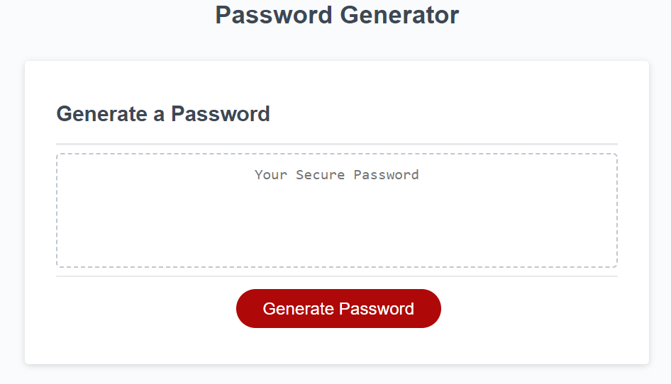

# Challenge 03 - JavaScript Password Generator

## Description

In this task I was tasked with adding JavaScript to existing code. The code had HTML and CSS as well as some starter JavaScript. I had to create a password generator using JavaScript. 

My class and I worked together to complete the task, we were instructed by one of the assistants throughout.

You can see the script work when clicking generating password and following all the prompts and playing around with it.

## Usage

You can view the page through this link .... 

## Preview

## Credits

Teacher assistant

## License

This project is licensed under the [MIT License](./LICENSE).